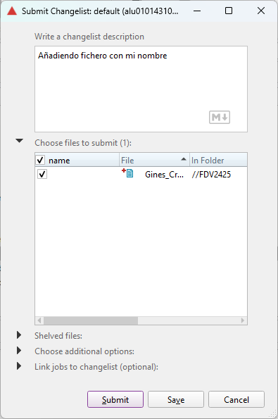

# 1.3. Unity Perforce
1. Crear una conexión al depósito FDV2425 en la ULL

Nos conectamos al Perforce de la ULL y buscamos el depot FDV2425.

Creamos un workspace y lo vinculamos al depot.

2. Clonar el repositorio

Clonamos el contenido del depot a nuestro workspace.

3. Modificar el fichero presentacion.txt, agregando una frase que indique tu nombre y resuma tu experiencia en el programación de videojuegos 2D y 3D.

Añadimos al fichero la siguiente línea: `Hola, soy Ginés Cruz Chávez y mi experiencia en programación de videojuegos consiste en un TFG sobre generación procedural 3D hecho en Godot, además de varios años de experiencia con el motor Unity.`.

4. Crear un fichero nuevo, tu_nombre.txt y añádelo al proyecto.

Creamos el fichero `Gines_Cruz_Chavez.txt` vacío y lo añadimos al depot.

5. Crear un proyecto Unity 3D básico y agregarlo al depot de la asignatura. Tu nombre debe ser prefijo.

Creamos el proyecto Unity 3D básico con una escena que contiene una esfera y un plano.

Añadimos el proyecto al depot con nombre "Gines_alu0101431079".

Añadimos los cambios y los subimos al depot.

